# WAI
#### 以下是对Tips for Getting Started Writing for Web Accessibility进行的翻译。
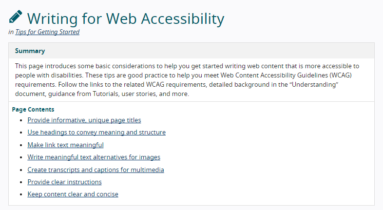
## 编写Web可访问性

在[入门提示中](https://www.w3.org/WAI/tips/)
|摘要|
|:---|:---:|---:|
|此页面介绍了一些基本注意事项，以帮助您开始编写残障人士更容易访问的Web内容。这些技巧是帮助您满足Web Content Accessibility Guidelines（WCAG）要求的良好实践。遵循相关WCAG要求的链接，“理解”文档中的详细背景，教程指南，用户案例等。|
* * *

##### 页面内容
> * 提供内容丰富，独特的页面标题
> * 使用标题传达含义和结构
> * 使链接文字有意义
> * 为图像编写有意义的文本替代
> * 创建多媒体文字记录和字幕
> * 提供明确的指示
> * 保持内容简洁明了

* * *

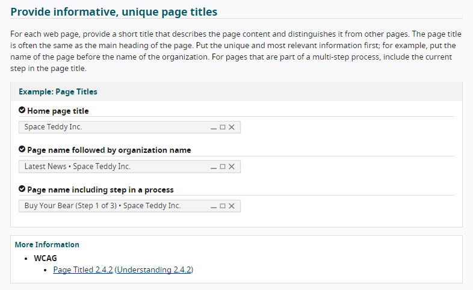
### 提供内容丰富，独特的页面标题

对于每个网页，请提供简短的标题，以描述页面内容并将其与其他页面区分开。页面标题通常与页面的主要标题相同。将独特且最相关的信息放在首位；例如，将页面名称放在组织名称之前。对于属于多步骤过程的页面，请在页面标题中包括当前步骤。

#### 示例：页面标题
> * √主页标题  
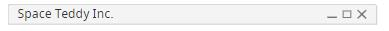
> * √页面名称后跟组织名称  
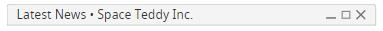
> * √页面名称，包括流程中的步骤  
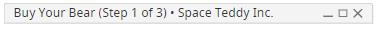

##### 更多信息
* WCAG
   * [标题为2.4.2的页面（[了解2.4.2](https://www.w3.org/WAI/WCAG21/Understanding/page-titled)）](https://www.w3.org/WAI/WCAG21/quickref/#page-titled)
* * *

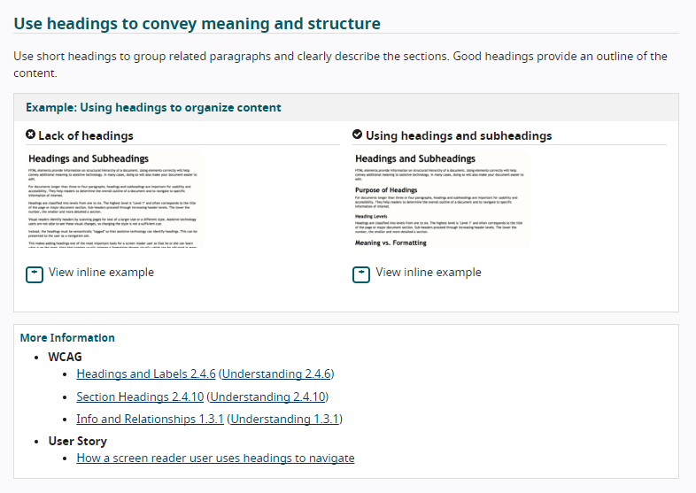
### 使用标题传达含义和结构

使用短标题将相关段落分组，并清楚地描述各节。好的标题提供了内容的大纲。

#### 示例：使用标题来组织内容

**×标题不足**
 +查看内联示例
> # 标题和子标题

> HTML元素提供有关文档结构层次结构的信息。正确使用元素将有助于向辅助技术传达其他含义。在许多情况下，这样做还可以使文档更易于编辑。

> 对于超过三，四段的文档，标题和小标题对于可用性和可访问性很重要。它们可以帮助读者确定文档的总体轮廓，并浏览到感兴趣的特定信息。

> 标题分为1到6级。最高级别是“级别1”，通常对应于页面或主要文档部分的标题。子标题通过增加标题级别进行。

> 视觉阅读器通过扫描页面中较大尺寸或不同样式的文本来识别标题。辅助技术用户无法看到这些视觉变化，因此，改变样式是不够的。

> 相反，必须在语义上对标题进行“标记”，以便辅助技术可以识别标题。这可以作为导航辅助呈现给用户。

> 这使添加标题成为屏幕阅读器用户最重要的工具之一，这样他或她就可以了解页面上的内容。请注意，标记通常会在视觉上触发格式更改，可以在许多文档中进行调整。

> 改编自[宾夕法尼亚州的标题和小标题](https://accessibility.psu.edu/headings/)
***

** √使用标题和副标题**
 +查看内联示例
> # 标题和子标题

> HTML元素提供有关文档结构层次结构的信息。正确使用元素将有助于向辅助技术传达其他含义。在许多情况下，这样做还可以使文档更易于编辑。

> ## 标题的目的

> 对于超过三，四段的文档，标题和小标题对于可用性和可访问性很重要。它们可以帮助读者确定文档的总体轮廓，并浏览到感兴趣的特定信息。

> ### 标题级别

> 标题分为1到6级。最高级别是“级别1”，通常对应于页面或主要文档部分的标题。子标题通过增加标题级别进行。

> ## 含义与格式

> 视觉阅读器通过扫描页面中较大尺寸或不同样式的文本来识别标题。辅助技术用户无法看到这些视觉变化，因此，改变样式是不够的。

> 相反，必须在语义上对标题进行“标记”，以便辅助技术可以识别标题。这可以作为导航辅助呈现给用户。

> 这使添加标题成为屏幕阅读器用户最重要的工具之一，这样他或她就可以了解页面上的内容。请注意，标记通常会在视觉上触发格式更改，可以在许多文档中进行调整。

> 改编自[宾夕法尼亚州的标题和小标题](https://accessibility.psu.edu/headings/)
***

##### 更多信息
* WCAG
   > * [标题和标签2.4.6](https://www.w3.org/WAI/WCAG21/quickref/#headings-and-labels) ([理解2.4.6](https://www.w3.org/WAI/WCAG21/Understanding/headings-and-labels))
   > * [本节标题2.4.10](https://www.w3.org/WAI/WCAG21/quickref/#section-headings) ([了解2.4.10](https://www.w3.org/WAI/WCAG21/Understanding/section-headings))
   > * [信息和关系1.3.1](https://www.w3.org/WAI/WCAG21/quickref/#info-and-relationships) ([了解1.3.1](https://www.w3.org/WAI/WCAG21/Understanding/info-and-relationships))

* 用户的故事
   > * [屏幕阅读器用户如何使用标题导航](https://www.w3.org/WAI/people-use-web/user-stories/#accountant)

* * *

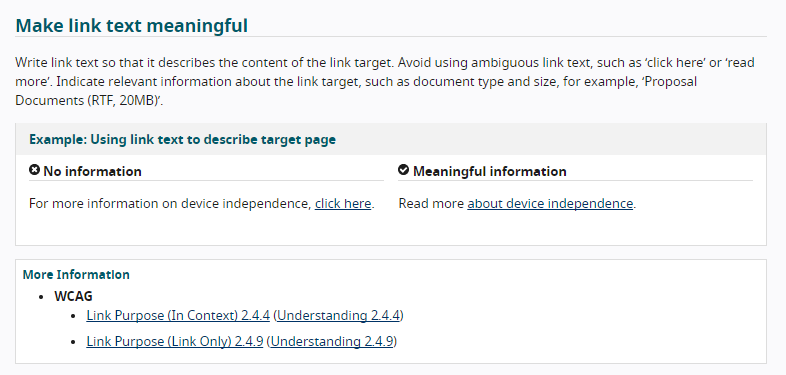
### 使链接文字有意义

编写链接文本，以描述链接目标的内容。避免使用歧义的链接文本，例如“单击此处”或“阅读更多”。指示有关链接目标的相关信息，例如文档类型和大小，例如“建议文档（RTF，20MB）”。

#### 示例：使用链接文本描述目标页面
|**×无信息**|**√有意义的信息**|
|:----|:----|
| 有关设备独立性的更多信息，[请单击此处。](about:blank#blocked)| 阅读[有关设备独立性](about:blank#blocked)的[更多信息。](about:blank#blocked)|

##### 更多信息
* WCAG
   > * [链接目的（在上下文中）2.4.4](https://www.w3.org/WAI/WCAG21/quickref/#link-purpose-in-context) ([理解2.4.4](https://www.w3.org/WAI/WCAG21/Understanding/link-purpose-in-context))
   > * [链接目的（仅链接）2.4.9](https://www.w3.org/WAI/WCAG21/quickref/#link-purpose-link-only) ([理解2.4.9](https://www.w3.org/WAI/WCAG21/Understanding/link-purpose-link-only))

* * *

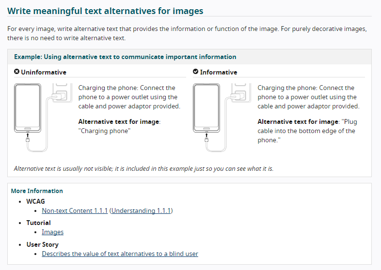
###  为图像编写有意义的文本替代   
---
对于每个图像，编写提供图像信息或功能的替代文本。对于纯装饰性图像，无需编写替代文本。  
#### 示例：使用替代文本传达重要信息  
|  没有信息  | 内容丰富  |
|  ----  | ----  |
| 为手机充电：使用随附的电缆和电源适配器将手机连接至电源插座。 | 为手机充电：使用随附的电缆和电源适配器将手机连接至电源插座。 |
| **图片的替代文本：**“正在为手机充电”   | **图片的替代文本：**“将电缆插入电话的底部边 |
*替代文字通常不可见；它包含在此示例中只是为了您可以看到它是什么。*
##### 更多信息
* WCAG
> * 非文本内容1.1.1（理解1.1.1）
* 讲解
> * 图片
* 用户的故事
> * 向盲人用户介绍替代文本的价值    
---

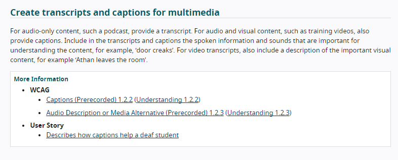
### 创建多媒体文字记录和字幕  
---
对于纯音频内容（例如播客），请提供成绩单。对于音频和视频内容（例如培训视频），也提供字幕。在成绩单和字幕中包括对理解内容很重要的语音信息和声音，例如“门吱吱作响”。对于视频成绩单，还包括重要视觉内容的描述，例如“ Athan离开房间”。  

##### 更多信息
* WCAG
> * 字幕（预先录制）1.2.2（理解1.2.2）
> * 音频描述或媒体替代（预先录制）1.2.3（了解1.2.3）
* 用户的故事
> * 描述字幕如何帮助聋哑学生
---
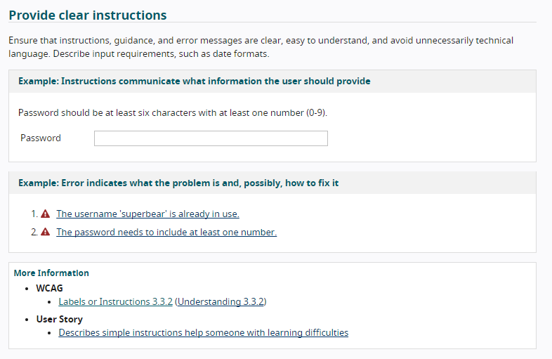
### 提供明确的指示
---
确保说明，指导和错误消息清晰，易于理解，并避免不必要的技术性语言。描述输入要求，例如日期格式。   

#### 示例：说明传达用户应提供哪些信息
密码至少应包含六个字符，并且至少包含一个数字（0-9）。  
密码  
#### 示例：错误指示问题所在以及可能的解决方法
 1.用户名“ superbear”已在使用中。  
 2.密码必须至少包含一个数字。
##### 更多信息
* WCAG
> * 标签或说明3.3.2（理解3.3.2）
* 用户的故事
> * 描述简单的说明，帮助学习有困难的人
---
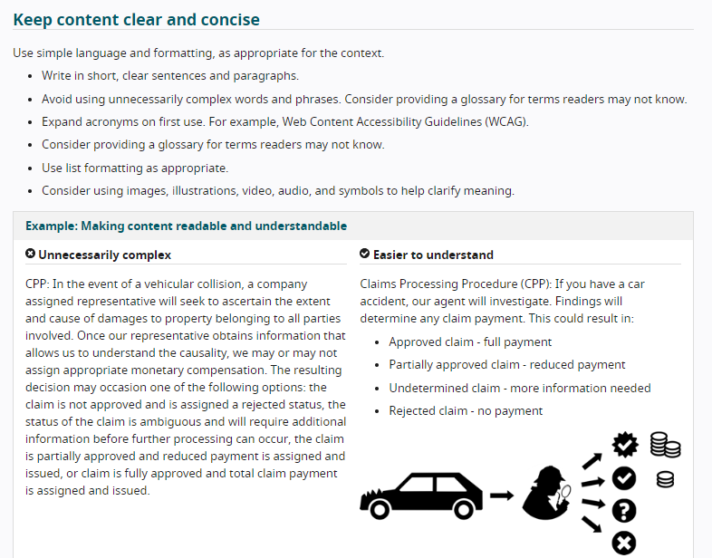
### 保持内容简洁明了
---
根据情况，使用简单的语言和格式。

> * 撰写简短明了的句子和段落。
> * 避免使用不必要的复杂单词和短语。考虑为读者可能不知道的术语提供词汇表。
> * 首次使用时请缩写。例如，Web内容可访问性指南（WCAG）。
> * 考虑为读者可能不知道的术语提供词汇表。
> * 适当使用列表格式。
> * 考虑使用图像，插图，视频，音频和符号来帮助阐明含义。
#### 示例：使内容易读易懂
|  不必要的复杂  | 更容易理解  |
|  ----  | ----  |
| CPP：万一发生车辆碰撞，公司指派的代表将寻求查明所涉各方财产的损害程度和原因。一旦我们的代表获得使我们了解因果关系的信息，我们可能会分配也可能不会分配适当的货币补偿。最终的决定可能会出现以下选择之一：索赔未获批准并被指定为拒绝状态，索赔的状态不明确，在进一步处理之前将需要其他信息，部分索赔已获批准并且减免了付款。分配和签发，或者索赔已完全批准，并且分配了总索赔付款。  | 索赔处理程序（CPP）：如果您发生车祸，我们的代理商将进行调查。调查结果将确定任何索赔款项。这可能导致：批准的索赔-全额付款；部分批准的索赔-减少付款；未确定的索偿-需要更多信息；索赔被拒-不付款  |

---
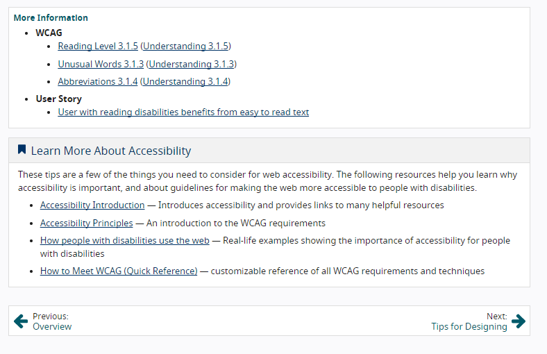
##### 更多信息
* WCAG
> * 阅读级别3.1.5（理解3.1.5）
> * 不寻常的单词3.1.3（理解3.1.3）
> * 缩写3.1.4（理解3.1.4）
* 用户的故事
> * 阅读障碍者受益于易于阅读的文本
***
 ** 了解有关辅助功能的更多信息 **  
这些技巧是您需要进行Web访问的一些注意事项。以下资源可帮助您了解为什么可访问性很重要，以及有关使残障人士更易访问网络的准则。  

* 辅助功能简介 —介绍辅助功能并提供许多有用资源的链接
* 易访问性原则 -一个介绍WCAG要求
* 残疾人如何使用网络 -现实生活中的例子表明了残疾人无障碍获取的重要性
* 如何满足WCAG（快速参考） -所有WCAG要求和技术的可定制参考  

| 上一页： | 下一页： |
| -- | -- |
| 概述| 设计技巧 |

---
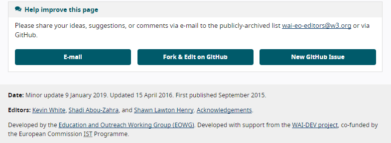
** 帮助改善此页面 **  
请通过电子邮件将您的想法，建议或评论分享到公开存档的列表wai-eo-editors@w3.org或通过GitHub。  

* 电子邮件
* 在GitHub上fork并编辑
* Github上创建新的issue  

 
** 日期： **2019年1月9日进行较小更新。2016年4月15日更新。2015年9月首次发布。  

** 编辑者： ** 凯文·怀特（Kevin White），沙迪·阿布·扎赫拉（Shadi Abou-Zahra）和肖恩·劳顿·亨利（Shawn Lawton Henry）。致谢。  

由教育与拓展工作组（EOWG）开发。在WAI-DEV项目的支持下开发，该项目由欧盟委员会IST计划共同资助。  

