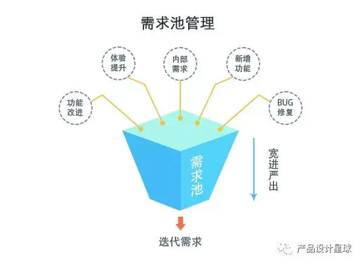
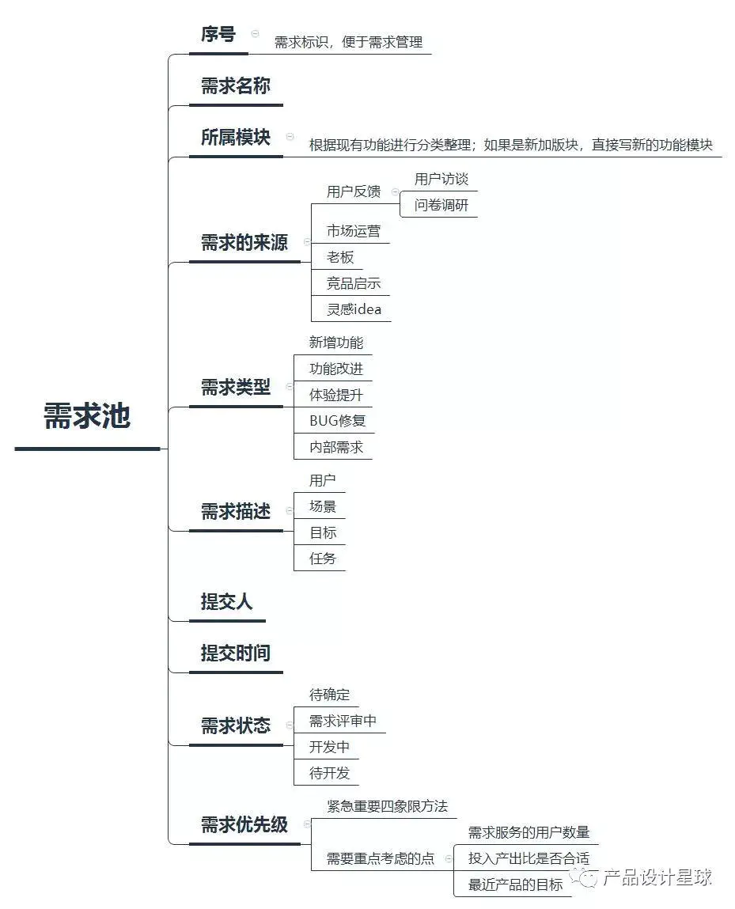

### 需求评估与需求池练习作业
两组轮流扮演“用户”/“项目经理/产品经理”。
#### 1.[【腾讯文档】需求池：H组对E组的需求进行的需求评估](https://docs.qq.com/sheet/DRkFsR2lZcEdra3lm)
#### 2.H组评估E组需求的过程：
1.用户原本提出的表层需求是在页面增加一个专门的区域用于放置文章。
由项目经理/产品经理分析其需求是在用户想要在网站浏览文章，网站中有多篇文章的环境下，满足快速找到文章区域任务，因此其深层需求是在首页需要一个按钮快速跳转到专门放置文章的页面，达到快速找到文章并达到与轮播图上的事件区分的效果。

2.用户原本提出的表层需求是成员头像在光标悬浮状态时显示放大，光标离开时恢复正常尺寸大小。
由项目经理/产品经理分析其需求是在浏览网页成员信息环境下，满足明确用户所查看的成员的详细信息的任务，因此其深层需求是需要悬浮状态的图标，起到显著的标识引导作用。

3.用户原本提出的表层需求是将图案、字体和页面背景进行缩小，页面四周补充留白。
由项目经理/产品经理分析其需求是用户浏览整个网页下，满足有良好视觉效果的任务，因此其深层需求是整改网页布局，增加留白，使网页更加美观。

Q&A:  
Q:什么是需求池？  
A:让需求宽进严出，以保证开发的需求都是有助于产品发展的。
* 需求池  

* 需求池内容  

[来源：简书]
